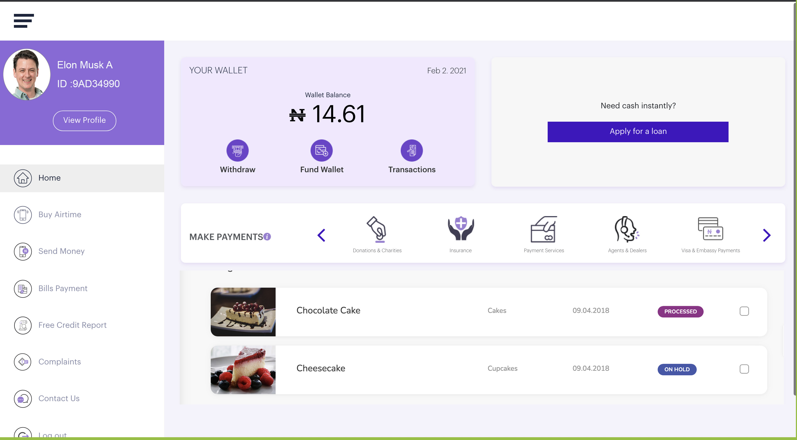
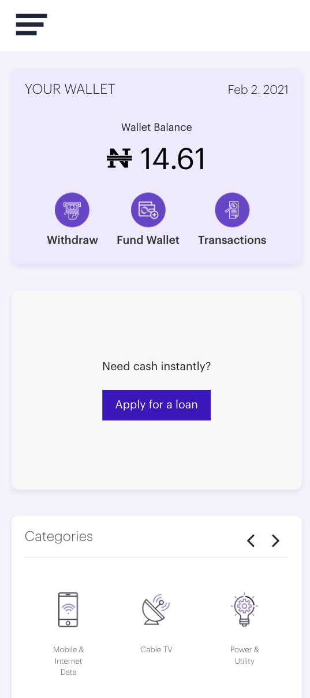
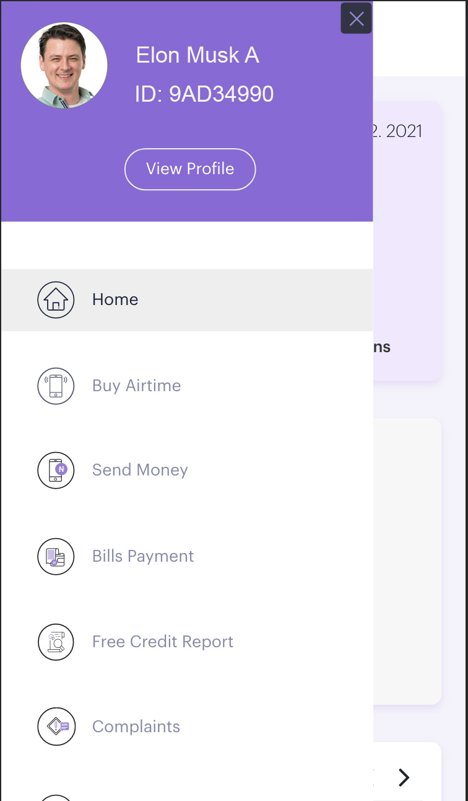

# Reanest Frontend Task

[Reanest Board Live](https://reanest-board.firebaseapp.com)

# Resources

- [Fontawesome icons](https://github.com/FortAwesome/react-fontawesome)
- [Offical docs](https://fontawesome.com/how-to-use/on-the-web/using-with/react)

`npm i -S @fortawesome/fontawesome-svg-core @fortawesome/react-fontawesome @fortawesome/free-regular-svg-icons @fortawesome/free-solid-svg-icons @fortawesome/free-brands-svg-icons `

# Screenshot

